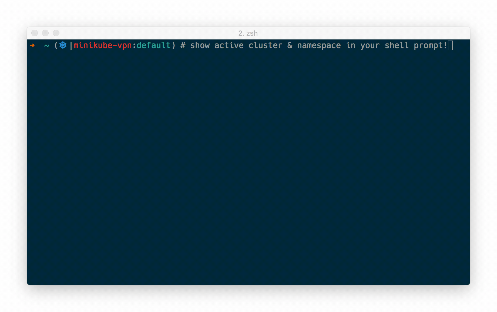

---
# Kubernets Cheats Sheets
1. [Kubernets Cheatsheet](https://kubernetes.io/docs/reference/kubectl/cheatsheet/)
2. [Kubernets Commands ](https://kubernetes.io/docs/reference/generated/kubectl/kubectl-commands)


# Auto completion of kubernets Commands 
In Bash, we can do autocomletion of kubectl commands 

For faster command Execution
s
example:

	Kubectl exec -it ngin
Hit tab you will automatically promt 

	Kubectl exec -it nginx-f89759699-8rzf8


we need to add lines in the ~/.bashrc

```
source <(kubectl completion bash)
echo "source <(kubectl completion bash)"
alias k=kubectl
complete -F __start_kubectl k
```
After Addding just reload the profile by
```
source ~/.bashrc
```
---
# Kubectx

kubectx is a utility to manage and switch between kubectl contexts.


```
USAGE:
  kubectx                   : list the contexts
  kubectx <NAME>            : switch to context <NAME>
  kubectx -                 : switch to the previous context
  kubectx -c, --current     : show the current context name
  kubectx <NEW_NAME>=<NAME> : rename context <NAME> to <NEW_NAME>
  kubectx <NEW_NAME>=.      : rename current-context to <NEW_NAME>
  kubectx -d <NAME>         : delete context <NAME> ('.' for current-context)
                              (this command won't delete the user/cluster entry
                              that is used by the context)
  kubectx -u, --unset       : unset the current context
```

Usage

```
$ kubectx
oregon
minikube

$ kubectx oregon
Switched to context "oregon".

```


# kubens

kubenx is a utility to manage and switch between kubectl namespaces.


```
USAGE:
  kubens                    : list the namespaces
  kubens <NAME>             : change the active namespace
  kubens -                  : switch to the previous namespace
  kubens -c, --current      : show the current namespace
```


usage
```
$ kubens kube-system
Context "test" set.
Active namespace is "kube-system".

$ kubens -
Context "test" set.
Active namespace is "default".
```
kubens also supports Tab completion on bash/zsh/fish shells.

# installation
---
```
sudo git clone https://github.com/ahmetb/kubectx /opt/kubectx
sudo cp /opt/kubectx/kubectx /usr/local/bin/kubectx
sudo cp /opt/kubectx/kubens /usr/local/bin/kubens
```

## Reference

- [kubectx](https://github.com/ahmetb/kubectx)
- [kubens](https://github.com/ahmetb/kubectx)

---

Its Very diificult to know Which Cluster you are in the Kubernets. 

There  is a script By which, you can able to promt in Bash in which cluster You are in , and which namespace you are in Namespace.


# kube-ps1: Kubernetes prompt for bash


## Bash

Download the script and paste in the location.

```
curl -o https://github.com/jonmosco/kube-ps1/blob/master/kube-ps1.sh /path/to/kube-ps1.sh
```
Copy below Commands in the ~/.bashrc
```
source /path/to/kube-ps1.sh
PS1='[\u@\h \W $(kube_ps1)]\$ '
```

After Addding just reload the profile by

```
source ~/.bashrc
```

Your will be promted with Bash like below



reference: 
-  [Kubernets ps1 ](https://github.com/jonmosco/kube-ps1)

---
# Execute the Command Inside the Container

Some times you may need to execute Command, Inside the container to check services, telnet, nslookup 

```
kubectl run multitool --image=praqma/network-multitool
```

Add below command in the ~/.bashrc
```
alias kip="kubectl exec -it multitool --"
```
After Addding just reload the profile by
```
source ~/.bashrc
```
Then you can execute following Commands inside the pod

```
kip nslookup kubernetes
``` 

